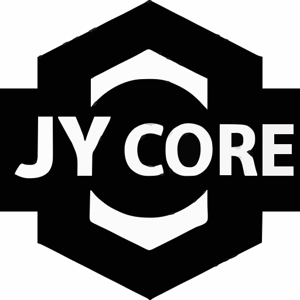

  

# JY Core

Backend systems and foundational services.

---

## Overview

Focused on backend development and system design, with an emphasis on clear structure and reliability.

---

## Tech Stack

- Java 17 (LTS)
- Spring Boot 3
- Spring Security
- REST APIs
- SQL / JPA

---

## Services

### jycore-auth-service
Authentication and authorization using JWT and role-based access control.

### jycore-notification-service
Handles asynchronous notification processing using a queue-based approach.

### jycore-gateway
Routes incoming requests to internal services and acts as a single entry point.

---

## Current Focus

- Building clean service architecture
- Improving system design and structure
- Developing consistent backend patterns

---

## Contact

- Email: jycore.dev@gmail.com
